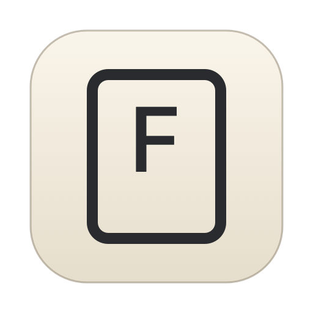
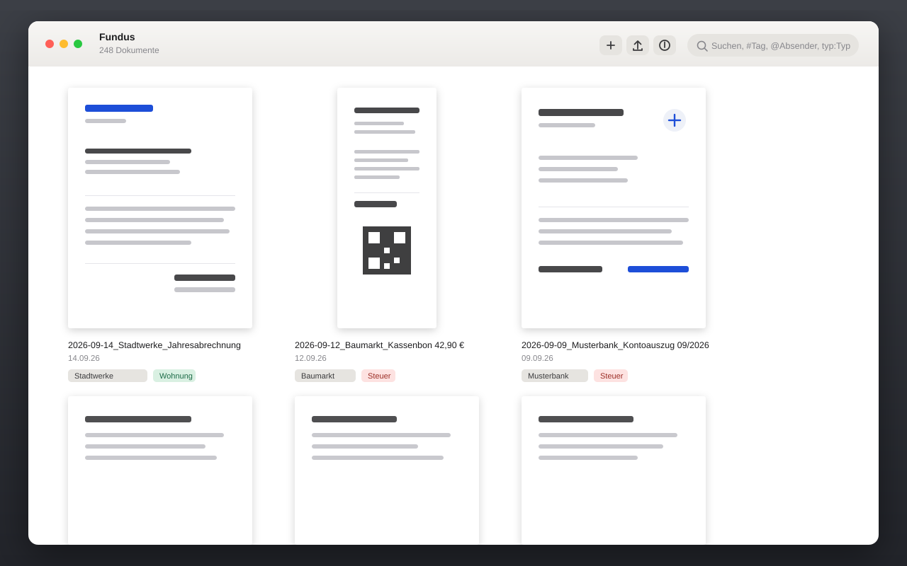
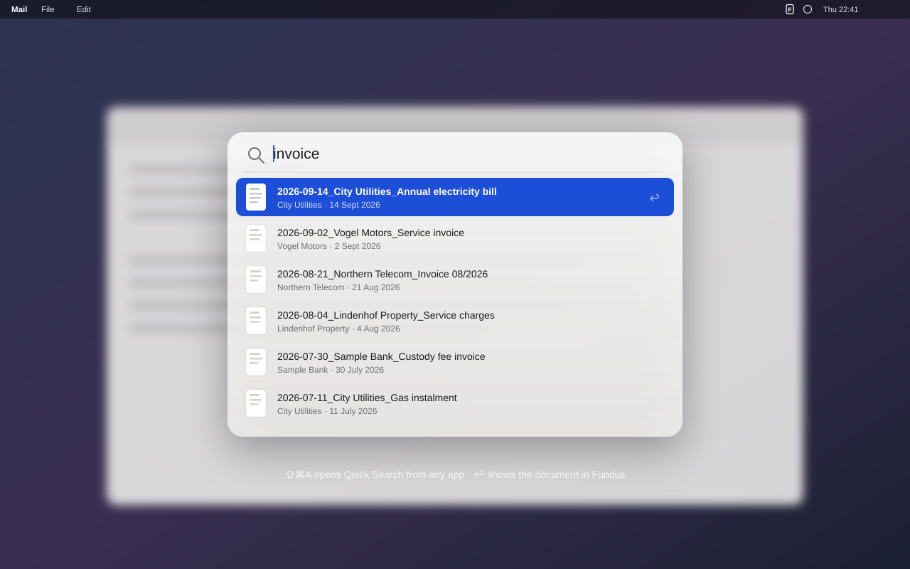
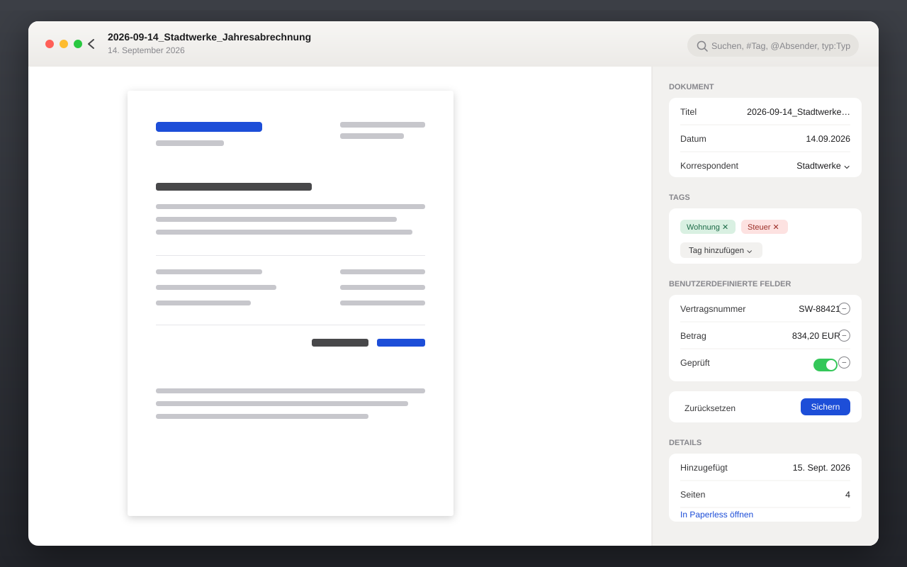

<div align="center">
  
  <h1>Fundus</h1>
  <p><strong>A native macOS client for Paperless-ngx — minimal, fast, and at home behind SSO.</strong></p>
  <p>
    
    
    
  </p>
</div>

Fundus shows your Paperless-ngx archive the way a Mac app should: one window, your documents at their real aspect ratio, and no sidebar full of filters you never use. It talks to a plain Paperless login just as happily as to an instance published behind an SSO gateway such as [Pangolin](https://github.com/fosrl/pangolin).

> The screenshots below are mockups with made-up documents — no real archive is shown.



## Features

### Find things

- **Quick Search from anywhere.** A global shortcut (⇧⌘A by default, freely configurable) opens a floating search panel over whatever app you are in — press ↩ and the document opens in Fundus. It searches the local copy, so results appear as you type, even offline.
- **Filters you type.** `#tag`, `@correspondent`, `typ:type` turn into tokens right in the search field; everything else goes to Paperless' full-text index. Quoted names work too: `#"house and garden"`.
- **Spotlight.** Every document is reported to Spotlight with title, text, tags and thumbnail. A hit opens it in Fundus.



### Work through your inbox

- **Edit metadata in place.** Title, date, correspondent, document type and tags in an inspector column — ⌘S saves.
- **Custom fields.** Assigned fields appear with the right control for their type: text, URL, number, amount with currency, date, yes/no, select list and document links. Add or remove fields per document; Fundus only sends them when you actually changed something.
- **Done and next.** ⌘↩ saves, strips the inbox tags and moves on to the next document.
- **Workflow aware.** Paperless workflows that run on "document updated" can change a document right after saving. Fundus reloads it and tells you when that happened.



### Get documents in and out

- **Import** by dropping files on the window or with ⌘O. Files are streamed, not loaded into memory, and the Paperless task is tracked until the document exists — including the reason when it fails, e.g. a duplicate.
- **Drag out.** Drag a document from the window into Finder, Mail or anywhere else and you get the original file.
- **Share and export** the selection (⇧⌘S / ⌘E), several documents at once.

### Stay out of the way

- **Menu bar app.** ⌘Q only closes the windows and hides the Dock icon; Fundus keeps running in the menu bar, watching for new documents. Optionally with no Dock icon at all, and with a launcher that starts it silently at login.
- **Notifications** for new documents, with a thumbnail; a click opens the document.
- **Offline copy.** Titles, text and thumbnails of every document are kept locally, plus the 150 most recently opened previews. Without a connection you can still search and read what you opened before.
- **Light and dark.** Liquid Glass on macOS 26, the previous materials before that, and an app icon that switches with the system appearance.

## Install

Download the `.dmg` from [Releases](../../releases) and drag Fundus to your Applications folder, or build it yourself (below). The app is signed with a self-made certificate, so on first launch use **right click → Open** and confirm once.

## Connecting

1. Enter your Paperless address.
2. A sign-in window opens: your Paperless login, or your SSO gateway's.
3. If your Paperless profile has an API token, Fundus adopts it. Otherwise enter user name and password under **Settings → Connection** — Fundus fetches a token via `/api/token/` and stores only that, in the keychain.

### Behind Pangolin

Pangolin's badger plugin answers `/api/*` with `401 text/plain` before Paperless ever sees the request. Fundus signs in through a WKWebView, copies the resource cookie into its URLSession and reuses it after a restart.

- **Passkeys don't work in that window.** macOS only allows WebAuthn in embedded web views for signed browsers with the entitlement. Use "sign in with another device" (QR code) or a login code instead — the banner in the sign-in window has a button for it.
- While the session is expired, Fundus stops fetching thumbnails and polling for new documents: a series of 401s looks like an attack to CrowdSec.
- Fundus never sends `DELETE`. CrowdSec on that stack blocks body-less DELETE over HTTP/3.

## Keyboard

| | |
|---|---|
| ⇧⌘A | Quick Search from any app (configurable) |
| Click, ⌘-click, ⇧-click, ⌘A | select, add to selection, range, all |
| Double click, Space, ↩, ⌘↓ | read in the same window |
| Esc, ⌘↑ | leave reading mode, clear selection |
| ← → ↑ ↓ | move through the grid; previous/next document while reading |
| ⌘I | inspector: title, date, correspondent, type, tags, custom fields (⌘S saves) |
| ⇧⌘I | show inbox |
| ⌘↩ | in the inbox: save, remove inbox tags, next document |
| ⌘F | search field |
| ⌘+ / ⌘− / ⌘0 | larger, smaller, reset the view |
| ⌘O, drop files | import |
| ⇧⌘S / ⌘E | share / export the selection |
| ⇧⌘O | open in Paperless |
| ⌘R | reload |

## Build it yourself

macOS 15 or newer. Xcode is not required, the Command Line Tools are enough:

```sh
./test.sh
./build.sh
open build/Fundus.app
```

- `build.sh` builds against the newest macOS 26 SDK (in the 27 SDK `@State` is a macro whose plugin ships only with Xcode), writes the real SDK version into the binary with `vtool` so macOS grants the current design, renders the icons, assembles the bundle and signs it with hardened runtime using a self-made certificate in `.signing/` — your login keychain is left alone.
- `test.sh` runs the Swift Testing suite and also verifies that every visible string has an English translation. German is the development language; the app ships German and English.

## How it is built

Plain SwiftUI, no dependencies. `PaperlessClient` speaks API version 9 and classifies every response so a gateway's sign-in page is never mistaken for a Paperless error. `LibraryStore` is an actor holding the offline copy, `AppModel` is the single `@Observable` source of truth for the UI. Logging goes to the unified log:

```sh
log stream --predicate 'subsystem == "de.max-venz.ablage"' --level info
```

The bundle identifier stays `de.max-venz.ablage` for compatibility, and both `ablage://` and `fundus://` links open documents.

## License

MIT — see [LICENSE](LICENSE). Not affiliated with the Paperless-ngx project.
